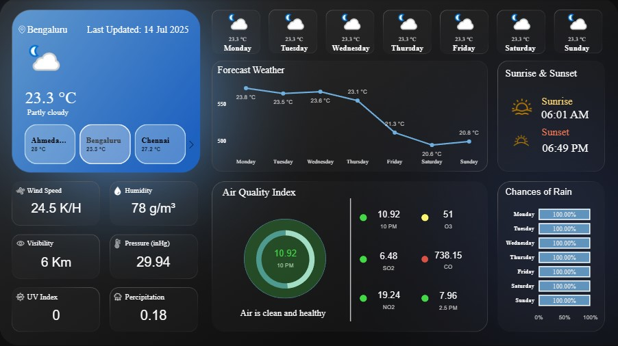

# 🌦️ Weather Power BI Dashboard

A visually interactive and real-time **Weather Dashboard** built using **Power BI** to display current conditions, forecast trends, and air quality for **Mumbai**, **Pune**, **Bengaluru**, **Gurgaon**, **Chennai**, **Ahmedabad**, **Noida**, **Hyderabad**, India.

---

---
## 📊 Dashboard Overview

This Power BI dashboard provides an at-a-glance view of:

- ✅ Current Weather Metrics
- 📅 7-Day Weather Forecast
- 🌅 Sunrise & Sunset Timings
- 🌫️ Air Quality Index (AQI)
- 🌧️ Rain Probabilities
- 🌍 City Comparisons (Bengaluru, Ahmedabad, Chennai)

---

## 🔍 Key Features

### 🌤️ Current Weather (Bengaluru)
- **Temperature**: 23.3 °C (Partly Cloudy)
- **Humidity**: 78 g/m³
- **Wind Speed**: 24.5 K/H
- **Pressure**: 29.94 inHg
- **Visibility**: 6 Km
- **Precipitation**: 0.18 mm
- **UV Index**: 0

---

### 📈 7-Day Forecast

### 🌄 Sunrise & Sunset

### 🌧️ Chances of Rain
(High chance of rain every day)

### 🌫️ Air Quality Index (AQI)
- **Overall AQI**: Good
- **Pollutants**:
  - O₃
  - SO₂
  - CO
  - NO₂
  - PM2.5

---

## 📌 Notes
- Fully responsive design with interactive tiles and icons
- Designed for environmental analysis, public safety, and planning

---

## 🔄 Data Refresh
- Dashboard reflects the most recent weather update.
- Automatically refreshed based on the connected data source schedule.

---

## 🛠️ Technologies Used
- Microsoft Power BI
- Real-time weather APIs
- Custom visuals for charts and gauges

---
